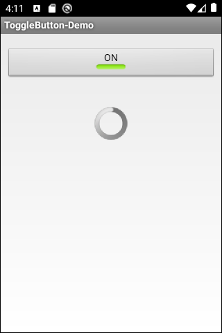
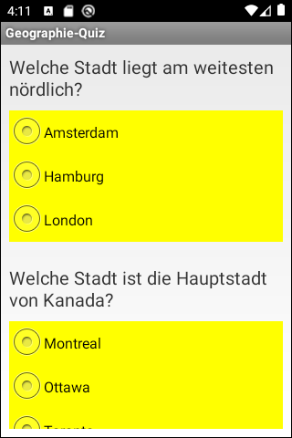
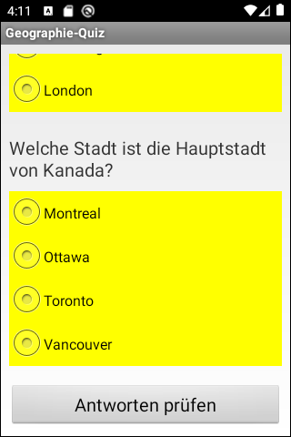
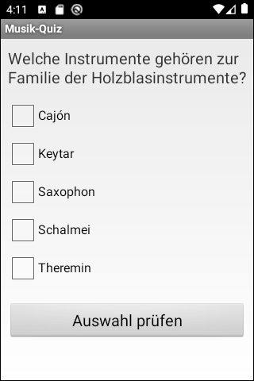
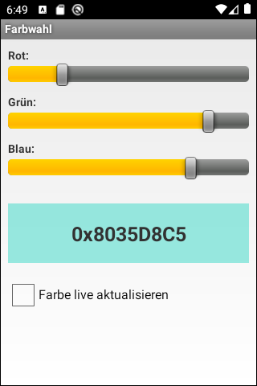

# Android-App "Weitere UI-Elemente" #

 

Android app to demonstrate the basic usage of the following UI elements:
* ToggleButton
* ProgressBar
* RadioGroup and RadioButton
* CheckBox
* SeekBar

 

Identifiers (names for classes, variables and methods), UI texts and (JavaDoc) comments are in German only.

 

----

## Screenshots ##

 

  

  

  

  

  

 

----

## License ##

 

See the [LICENSE file](LICENSE.md) for license rights and limitations (BSD 3-Clause License).

 
